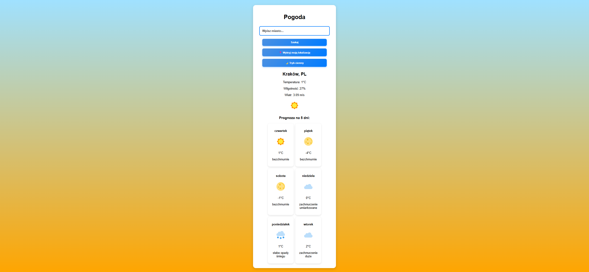

# 🌤️ Aplikacja Pogodowa

## 📸 Podgląd aplikacji



### 📌 Opis projektu

Aplikacja pogodowa pokazująca aktualne warunki pogodowe oraz 5-dniową prognozę. Dodatkowo obsługuje **tryb ciemny 🌙, dynamiczne tło 🎨 oraz automatyczne wykrywanie lokalizacji 📍**.

---

### ⚙️ Funkcje

✅ Pobieranie danych pogodowych z **OpenWeather API**  
✅ **Automatyczne wykrywanie lokalizacji użytkownika**  
✅ **Tryb ciemny 🌙 / jasny ☀️**  
✅ **Dynamiczne tło** zmieniające się w zależności od pogody  
✅ **Prognoza na 5 dni 📆**

---

### 🚀 Uruchomienie projektu

1. **Sklonuj repozytorium** (jeśli używasz GitHub):
   ```sh
   git clone https://github.com/Kornetas/weather-app.git
   ```
2. Otwórz **Visual Studio Code** i załaduj folder projektu.

3. Otwórz plik **`index.html`** w przeglądarce:
   - Kliknij prawym przyciskiem myszy → `Open with Live Server` (jeśli masz zainstalowany).
   - Lub po prostu **dwukrotnie kliknij `index.html`**, aby otworzyć go w przeglądarce.

✅ Gotowe! 🎉

### 🛠️ Technologie

✅ **HTML5** - struktura strony  
✅ **CSS3** - stylizacja (Responsywny Design, Tryb Ciemny)  
✅ **JavaScript** - logika aplikacji (Fetch API, LocalStorage)
